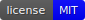

# bumpwright




Bumpwright inspects your project's public API and suggests the appropriate semantic version increment.

## Quickstart

Requires Python 3.11 or later.

```bash
pip install bumpwright
bumpwright init
bumpwright bump --decide
```

See the [documentation](docs/index.rst) for full usage, configuration, and development guidelines.

## License

Distributed under the MIT License. See [LICENSE](LICENSE) for details.

