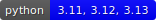

bumpwright documentation
========================

|coverage| |version| |python| |license|

Static public-API diff and heuristics to suggest semantic version bumps.

Bumpwright inspects a project's public API to highlight breaking changes and
recommend the appropriate semantic version increment. It is designed for
library maintainers, continuous integration systems, and release managers who
need a reliable view of how code changes affect downstream consumers.

Why Bumpwright?
---------------

Semantic versioning only works when release numbers reflect the true impact of
code changes. Tracking every public entry point by hand is tedious and
error-prone. Bumpwright automates this process with static analysis so you can
ship confident releases without manual bookkeeping.

How It Works
------------

Bumpwright compares two git references, builds a model of the public API for
each, and uses heuristics to determine whether changes are major, minor, or
patch level. The tool outputs a recommended bump and a list of detected
impacts, making it simple to understand the reasoning behind the suggestion.

Key Features
------------

- Static diff of functions, classes, and other exported symbols.
- Pluggable analysers for command-line interfaces, gRPC services, web routes,
  database migrations, OpenAPI specifications, and GraphQL schemas.
- Dry-run mode to preview changes without touching files.
- Output in plain text, Markdown, or JSON for easy integration.

Comparison to Similar Tools
---------------------------

.. list-table::
   :header-rows: 1

   * - Tool
     - Approach
     - Best for
     - Limitations
   * - Bumpwright
     - Public API analysis with heuristics
     - Libraries that expose a stable API
     - Requires a baseline reference
   * - bump2version
     - Manual version string management
     - Small projects with manual release workflow
     - No analysis of code changes
   * - semantic-release
     - Commit message conventions
     - Teams with disciplined commit history
     - Ignores actual API surface
   * - Release Please
     - Structured commit messages and release PRs
     - Mono-repos and automated PR-based releases
     - Doesn't inspect API changes

Getting Started
---------------

.. toctree::
   :maxdepth: 2

   installation
   quickstart
   usage/index

User Guide
----------

.. toctree::
   :maxdepth: 2

   configuration
   guides/index
   versioning

Reference
---------

.. toctree::
   :maxdepth: 2

   cli_reference
   analysers/index

Project Resources
-----------------

.. toctree::
   :maxdepth: 1

   troubleshooting
   performance
   roadmap

Community and Feedback
----------------------

Found a bug or have an idea? Open an issue or pull request on the project's
GitHub page to help make Bumpwright better.
